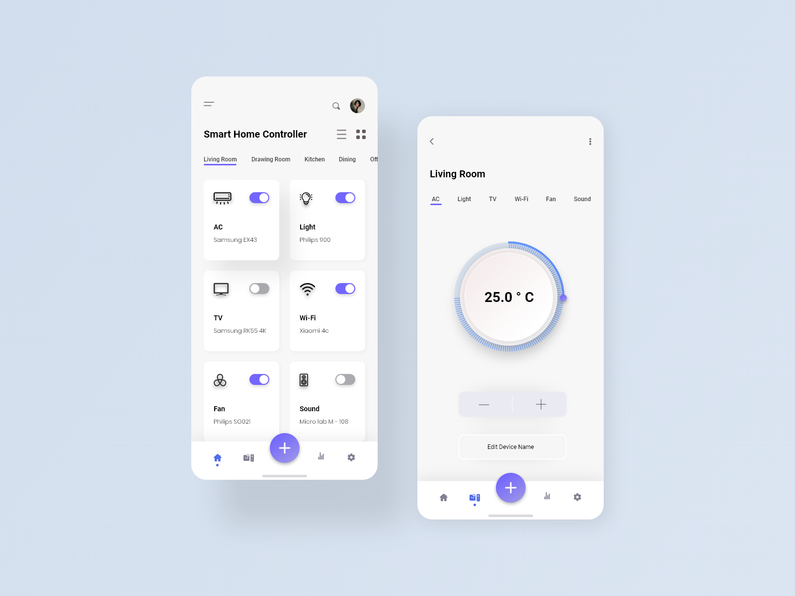
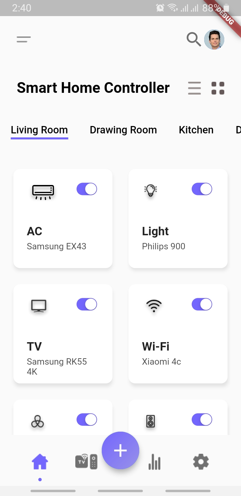
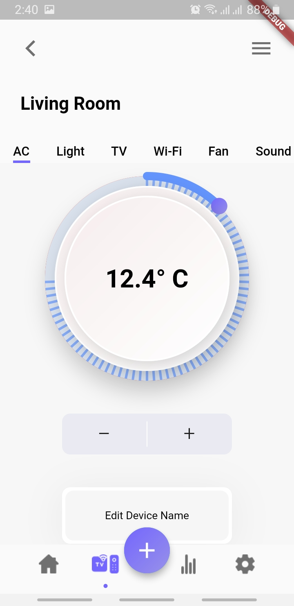

# smart_home_controller

A demo flutter with UI collected from internet. Link to original design can be found [here](https://www.uplabs.com/posts/smart-home-control-mobile-app).

Screenshots from the app.

 
 

This project was does not take any credit for designs. The aim of the project is to replicate the design into flutter app in order to test the boundaries.

Finally, if you like it or found useful, leave a star on the repository.